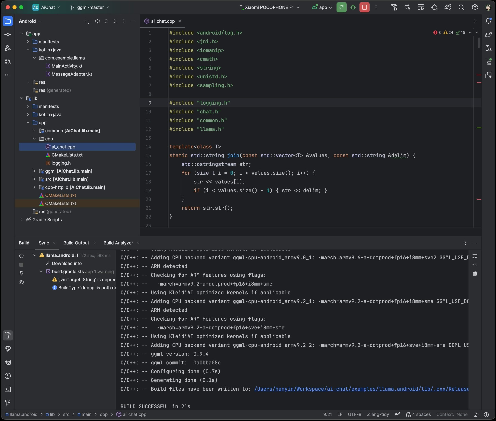

# Android

## 使用 Android Studio 构建 GUI 绑定

将 `examples/llama.android` 目录导入 Android Studio，然后执行 Gradle 同步并构建项目。


此 Android 绑定支持在 Android 和 ChromeOS 设备上，为 **Arm** CPU 提供最高 `SME2`、为 **x86-64** CPU 提供最高 `AMX` 的硬件加速。
它会自动检测宿主硬件并加载兼容内核。因此，无论是缺少现代 CPU 功能或内存有限的旧设备，还是最新的高端设备，它都能无缝运行，无需任何手动配置。

项目包含一个极简的 Android 应用前端，用于展示该绑定的核心功能：
1.	通过 `GgufMetadataReader` 解析 GGUF 元数据，数据源既可以是共享存储中由 `ContentResolver` 提供的 `Uri`，也可以是应用私有存储中的本地 `File`。
2.	通过 `AiChat` 外观获取 `InferenceEngine` 实例，并通过应用私有文件路径加载所选模型。
3.	发送原始用户提示词，以进行自动模板格式化、预填充和批量解码。然后在 Kotlin `Flow` 中收集生成的 token。

如需体验面向生产环境的高级功能，例如系统提示词和基准测试，以及友好的 UI 功能（如模型管理和 Arm 特性可视化工具），请前往 Google Play 查看 [Arm AI Chat](https://play.google.com/store/apps/details?id=com.arm.aichat)。
该项目由 Arm 的 **CT-ML**、**CE-ML** 和 **STE** 团队共同完成：

|   |   |   |
|:------------------------------------------------------:|:----------------------------------------------------:|:--------------------------------------------------------:|
|                      主屏幕                       |                    系统提示词                     |                         "Haiku"                          |

## 在 Android 上使用 Termux 构建 CLI

[Termux](https://termux.dev/en/) 是一款 Android 终端模拟器和 Linux 环境应用（无需 root）。截至本文撰写时，Termux 正在 Google Play 商店中以实验性方式提供；此外，也可以直接从项目仓库或 F-Droid 获取。

使用 Termux，你可以像使用 Linux 环境一样安装并运行 `llama.cpp`。进入 Termux shell 后：

```
$ apt update && apt upgrade -y
$ apt install git cmake
```

然后按照 [构建说明](https://github.com/ggml-org/llama.cpp/blob/master/docs/build.md) 进行操作，特别是 CMake 部分。

二进制文件构建完成后，下载你选择的模型（例如从 Hugging Face 下载）。为获得最佳性能，建议将其放在 `~/` 目录下：

```
$ curl -L {model-url} -o ~/{model}.gguf
```

然后，如果你尚未进入仓库目录，请 `cd` 进入 `llama.cpp` 并执行：

```
$ ./build/bin/llama-cli -m ~/{model}.gguf -c {context-size} -p "{your-prompt}"
```

这里我们展示的是 `llama-cli`，但理论上 `examples` 目录下的任何可执行文件都可以使用。请务必一开始就将 `context-size` 设置为合理的数值（例如 4096）；否则内存可能会激增并导致终端被终止。

若想直观地了解其效果，下面是一段在 Pixel 5 手机上运行交互式会话的旧演示：

https://user-images.githubusercontent.com/271616/225014776-1d567049-ad71-4ef2-b050-55b0b3b9274c.mp4

## 使用 Android NDK 交叉编译 CLI

可以在你的主机系统上通过 CMake 和 Android NDK 为 Android 构建 `llama.cpp`。如果你选择这条路径，请确保已准备好用于 Android 交叉编译的环境（即安装 Android SDK）。请注意，与桌面环境不同，Android 环境只提供有限的本地库，因此在使用 Android NDK 构建时，CMake 只能使用这些库（参见：https://developer.android.com/ndk/guides/stable_apis）。

准备就绪并克隆 `llama.cpp` 后，在项目目录中执行以下命令：

```
$ cmake \
  -DCMAKE_TOOLCHAIN_FILE=$ANDROID_NDK/build/cmake/android.toolchain.cmake \
  -DANDROID_ABI=arm64-v8a \
  -DANDROID_PLATFORM=android-28 \
  -DCMAKE_C_FLAGS="-march=armv8.7a" \
  -DCMAKE_CXX_FLAGS="-march=armv8.7a" \
  -DGGML_OPENMP=OFF \
  -DGGML_LLAMAFILE=OFF \
  -B build-android
```

注意：
  - 虽然较新版本的 Android NDK 附带 OpenMP，但 CMake 仍需将其作为依赖项安装，而当前尚不支持此操作
  - `llamafile` 似乎不支持 Android 设备（参见：https://github.com/Mozilla-Ocho/llamafile/issues/325）

上述命令应会使用适合现代设备的最佳性能选项来配置 `llama.cpp`。即使你的设备不支持 `armv8.7a`，`llama.cpp` 也会包含运行时检查，以确定可用的 CPU 功能。

你可以根据目标设备自由调整 Android ABI。项目配置完成后：

```
$ cmake --build build-android --config Release -j{n}
$ cmake --install build-android --prefix {install-dir} --config Release
```

安装完成后，将所选的模型下载到你的主机系统上。然后：

```
$ adb shell "mkdir /data/local/tmp/llama.cpp"
$ adb push {install-dir} /data/local/tmp/llama.cpp/
$ adb push {model}.gguf /data/local/tmp/llama.cpp/
$ adb shell
```

在 `adb shell` 中：

```
$ cd /data/local/tmp/llama.cpp
$ LD_LIBRARY_PATH=lib ./bin/llama-simple -m {model}.gguf -c {context-size} -p "{your-prompt}"
```

完成！

请注意，Android 不会自动找到 `lib` 库路径，因此我们必须指定 `LD_LIBRARY_PATH` 才能运行已安装的可执行文件。Android 在较高的 API 级别中支持 `RPATH`，因此未来这一情况可能会改变。关于 `context-size`（非常重要！）和运行其他 `examples` 的信息，请参阅上一节。
