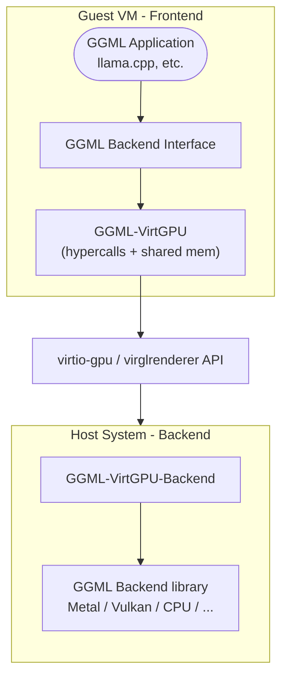

# GGML-VirtGPU 后端

GGML-VirtGPU 后端使 GGML 应用程序能够在宿主机硬件上运行机器学习计算，同时应用程序本身运行在虚拟机内部。它使用宿主机-客户机共享内存，在两者之间高效共享数据缓冲区。

该后端依赖于 virtio-gpu 和 VirglRenderer API Remoting（APIR）组件。后端分为两个库：
- 一个 GGML 实现（"远程前端"），运行在客户机中并与 virtgpu 设备交互
- 一个兼容 VirglRenderer APIR 的库（"远程后端"），运行在宿主机中并与 Virglrenderer 以及实际的 GGML 设备后端交互。

## 操作系统支持

| 操作系统 | 状态              | 后端        | CI 测试     | 备注
| -------- | ----------------- | ----------- | ----------- | -----
| MacOS 14 | 受支持            | ggml-metal  | X           | 在 MacOS 14 上编译时可用
| MacOS 15 | 受支持            | ggml-metal  | X           | 在 MacOS 14 或 MacOS 15 上编译时可用
| MacOS 26 | 未测试            |             |             |
| Linux    | 开发中            | ggml-vulkan | 不可用      | 本地可用，CI 出现死锁

## 架构概览

GGML-VirtGPU 后端由三个主要组件组成：

### 关键组件

1. **客户机侧前端**（`ggml-virtgpu/`）：实现 GGML 后端接口，并将操作转发到宿主机
2. **宿主机侧后端**（`ggml-virtgpu/backend/`）：接收转发的操作，并在实际硬件后端上执行
3. **通信层**：使用 virtio-gpu 超调用和共享内存进行高效数据传输

## 特性

- **宿主机侧动态后端加载**（CPU、CUDA、Metal 等）
- 通过宿主机-客户机共享内存页实现**零拷贝数据传输**

## 通信协议

### 超调用与共享内存

该后端使用两种主要通信机制：

1. **超调用**（`DRM_IOCTL_VIRTGPU_EXECBUFFER`）：从客户机触发到宿主机的远程执行
2. **共享内存页**：用于张量和参数的零拷贝数据传输

#### 共享内存布局

每个连接使用两个共享内存缓冲区：

- **数据缓冲区**（24 MiB）：用于命令/响应数据和张量传输
- **回复缓冲区**（16 KiB）：用于命令回复和状态信息
- **数据缓冲区**：动态分配的宿主机-客户机共享缓冲区，用作 GGML 缓冲区。

### APIR 协议

Virglrender API Remoting 协议定义了三种命令类型：

- `HANDSHAKE`：协议版本协商和能力发现
- `LOADLIBRARY`：在宿主机上动态加载后端库
- `FORWARD`：API 函数调用转发

### 二进制序列化

命令和数据使用自定义二进制协议序列化，具有以下特性：

- 基本类型采用固定大小编码
- 带大小前缀的可变长度数组
- 缓冲区边界检查
- 错误恢复机制

## 支持的操作

### 设备操作
- 设备枚举和能力查询
- 内存信息（总量/空闲）
- 后端类型检测

### 缓冲区操作
- 缓冲区分配和释放
- 张量数据传输（宿主机 ↔ 客户机）
- 内存复制和清零

### 计算操作
- 计算图执行转发

## 构建要求

### 客户机侧依赖
- 用于 DRM/virtio-gpu 通信的 `libdrm`
- 兼容 C++20 的编译器
- CMake 3.14+

### 宿主机侧依赖
- 支持 APIR 的 virglrenderer（上游审核中）
- 目标后端库（libggml-metal、libggml-vulkan 等）

## 配置

### 环境变量

- `GGML_VIRTGPU_BACKEND_LIBRARY`：宿主机侧后端库的路径
- `GGML_VIRTGPU_DEBUG`：启用调试日志

### 构建选项

- `GGML_VIRTGPU`：启用 VirtGPU 后端（`ON` 或 `OFF`，默认：`OFF`）
- `GGML_VIRTGPU_BACKEND`：构建宿主机侧后端组件（`ON`、`OFF` 或 `ONLY`，默认：`OFF`）

### 系统要求

- 支持 virtio-gpu 的虚拟机
- 带有 APIR 补丁的 VirglRenderer
- 宿主机上兼容的后端库

## 限制

- **虚拟机专属**：仅在支持 virtio-gpu 的虚拟机中工作
- **宿主机依赖**：需要正确配置的宿主机侧后端
- **延迟**：每次操作因虚拟机逃逸而产生少量开销
- **共享内存大小**：在使用 `libkrun` 虚拟机监控器时，RAM + VRAM 的可寻址内存限制为 64 GB。因此，最大 GPU 内存为 `64GB - RAM`，与硬件 VRAM 大小无关。

* 这项工作正在等待 VirglRenderer 项目的上游变更。
  * 可以使用以下 PR 从源码编译的 Virglrenderer 来测试该后端：
  https://gitlab.freedesktop.org/virgl/virglrenderer/-/merge_requests/1590
* 这项工作正在等待运行虚拟机的 VMM/虚拟机监控器的变更，这些变更需要知道如何路由新引入的 APIR capset。
  * 在相关虚拟机监控器打上补丁之前，环境变量 `VIRGL_ROUTE_VENUS_TO_APIR=1` 允许使用 Venus capset。但设置该标志会破坏 Vulkan/Venus 的正常行为。
  * 环境变量 `GGML_REMOTING_USE_APIR_CAPSET` 告诉 `ggml-virtgpu` 后端使用 APIR capset。当相关虚拟机监控器打上补丁后，这将成为默认行为。

* 这项工作专注于提升在 MacOS 容器中运行的 llama.cpp 的性能，并主要在该平台上进行测试。Linux 支持（通过 `krun`）正在进行中。

## 另请参阅

- [开发与测试](VirtGPU/development.md)
- [后端配置](VirtGPU/configuration.md)
